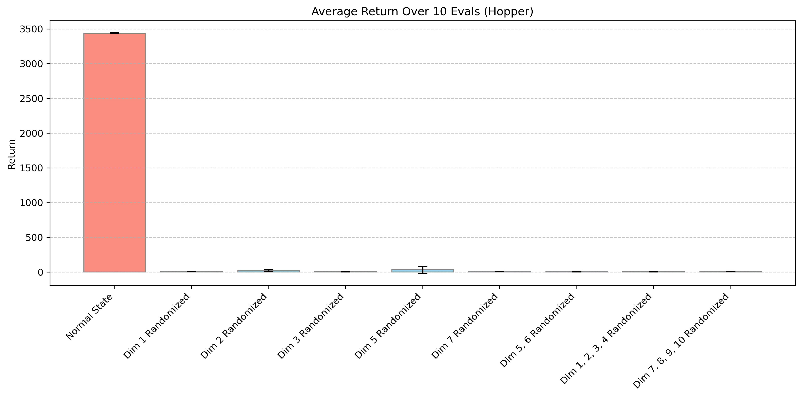

# authors-222-tables-charts

## Updated Paper based on reviewer feedback

Updated Paper Draft with the following edits

1. Condensed Table 1 to just include the best eval as well as the std of each test
2. Added the new baselines (TREX and Recurrent SAC) to Table 1 - Given time constraints, we were not able to complete all 18 tests for the new baseline, but we will continue to run the remaining experiments and add them to the draft
3. Added future directions to the conclusion and added further commentary in the future work section in the appendix
5. Added further commentary of when the Causal PBRS method works in Section 5.3
6. Added more detail to Figure 1
7. Moved Final Eval portion of Table 1 to Appendix (now Table 7)
8. Added best eval timestep for the SAC baseline and Causal PBRS method in Table 6.
9. Added RCIT tests to demonstrate confounding bias in Section 12
10. Polished texts and presentations

## CMDP in MuJoCo (not finalized)

To demonstrate the importance of the dimensions removed in the paper on the offline policy, we trained a Hopper agent using SAC under full observation capabilities (the same as the behavior policy used in offline data collection). For evaluation, we run two tests, one where the agent has full access to the state dimensions and one where some dimensions are replaced by randomized noise. In the latter tests, the agent is unable to get a strong score, showcasing the importance of the masked dimensions for the behavior policy. If these dimensions are missing from the offline dataset, methods that assume NUC (no unobserved confounders) may not be able to recover the optimal behavioral policy.

## New Baselines (not finalized)

Above are the performance graphs for Hopper 1, Hopper 2, Walker 8, and Ant 13 with two new baselines - TREX PBRS and Recurrent SAC. Overall, the Causal PBRS method continues to have the strongest performance, with neither of the two methods about to surpass the State Removed Baseline. The TREX PBRS used 5 seeds, whereas the Recurrent SAC used 3 seeds given time constraints (except for Ant, which uses 2). We found running the Recurrent SAC code to be much slower (at least 10x) given BPTT and larger memory requirements.
